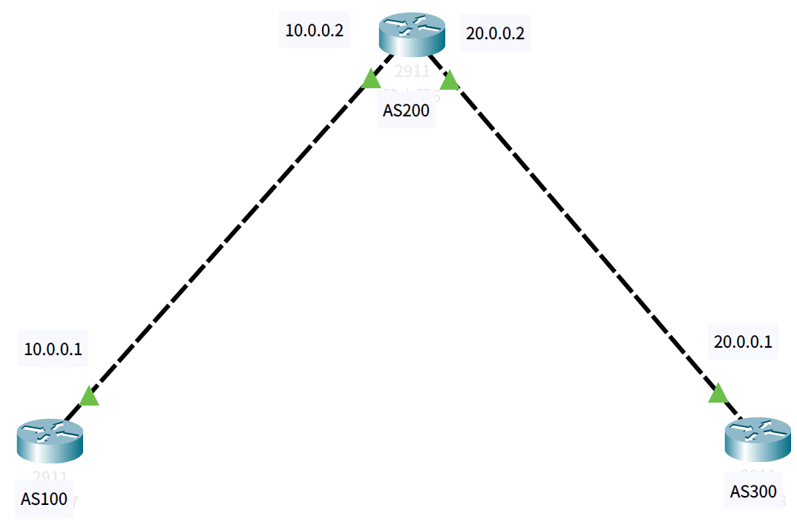
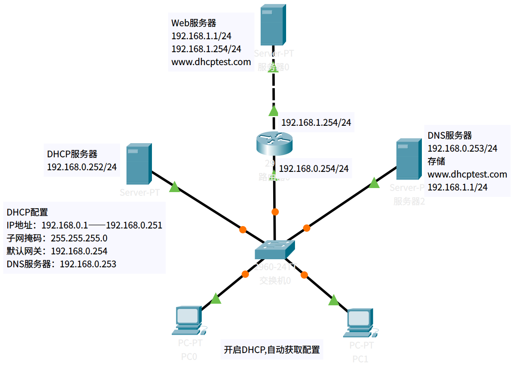

# packet-tracer

计算机网络——记录Packet Tracer的使用

# Packet Tracer使用

## 参考自https://www.bilibili.com/video/BV1At411f7hJ

注: 每个序号标题都提供了对应的pkt文件参考

packet tarcer[官网下载](https://skillsforall.com/resources/lab-downloads)

### 1.简单使用

#### 大致流程

- 构建网络拓扑
- 配置网络设备
- 跟踪数据包
- 查看数据包

#### 构建网络拓扑结构

三台PC加一台集线器，使用自动连接，将三台PC分别与集线器连接


#### 配置网络设备

将三台PC的IP依次设置为`192.168.0.1`、`192.168.0.2`、`192.168.0.3`

#### 发送数据包

发送一个简单的PDU协议数据单元即可。

注意：切换实时模式Realtime为仿真模式Simulation，才能逐步捕获数据包

#### 查看数据包

在仿真模式下发送一个PDU, 逐步捕获数据包的移动路径

---

**注意：以下步骤默认初始为实时模式，连线时会有指示灯显示，且若指示灯不为绿色，可尝试来回切换实时模式和仿真模式，直到所有指示灯显示为绿色（即正常工作）。关于传输细节的查看，可以直接点击单步捕获时，仿真软件中的信封图标**

### 2.访问Web服务器

1. 一台PC设置IP为`192.168.0.1`，一台服务器设置IP为`192.168.0.2`

   

2. 切换到仿真模式，设置过滤协议仅可见HTTP，打开PC中的浏览器访问服务器的IP，开始逐步捕获

### 3.MAC地址，IP地址，ARP协议

1. 两台PC，相互连接，分别配置IP地址`192.168.0.1`和`192.168.0.2`

   

2. 查看PC的端口汇总表和ARP高速缓存表(初始为空)

3. 切换到仿真模式，先用原PC发送一个PDU，**ICMP发送失败，会构建一个ARP广播请求**（由于初始ARP高速缓存表为空）

4. 另一台PC的ARP高速缓存表会被更新，**会构建一个ARP单播请求**，于是原PC接收ARP请求后也更新了ARP表

   这时，原PC可直接发送ICMP至另一台PC

   <font color='red'>APR请求的目的就是为了询问IP地址和MAC地址的对应关系</font>

5. 通过命令行清空原PC的ARP缓存表

   查看ARP高速缓存表，可以看到IP地址和MAC地址的对应关系

   ```powershell
   arp -a
   ```

   清空ARP高速缓存表

   ```powershell
   arp -d
   ```

   重新查看，确保删除

   ```powershell
   arp -a
   ```

6. 重新使用原PC发送一个PDU，可捕获到重新构建了ARP请求

### 4.总线型以太网的特性（广播，竞争总线，冲突）

1. 三台PC，使用集线器互连。每台PC配置IP地址`192.168.0.x`

   

2. 每两台PC间发送一个PDU，排除ARP广播对后续实验的观察

   **总线型以太网发送ICMP都是广播的形式，根据地址是否匹配来做出回应，地址匹配则再经过集线器进行广播，而地址不匹配则不做回应**

3. 删除之前的请求记录，切换到仿真模式

4. 使用PC0对PC1发送一个PDU，逐步捕获数据包并观察

5. 删除记录，使用PC0向PC2发送PDU，同时使用PC1也向PC2发送PDU

   **结果在集线器处发生了碰撞，并广播给所有连接集线器的PC一个碰撞帧后该帧被丢弃**

### 5.集线器和交换机的区别

1. 构建4个以太网，其中2个以太网（下面简称为A1，A2）分别使用三台PC+一台集线器，另外2个以太网（下面简称为B1, B2）分别使用三台PC+一台交换机，PC的IP地址提前配置完成

   <font color='red'>这里建议参考视频演示一步步搭建拓扑结构</font>

   

2. 让各以太网中的PC相互发送PDU，消除ARP广播的影响，删除请求记录

3. 切换到仿真模式，在A1以太网用PC0向PC1发送PDU，在B1以太网进行同样的操作

   **集线器会统一进行广播，而交换机具有过滤功能，会明确发送到目的PC而不会进行广播**

4. 将以太网A1，A2的集线器互联，同理将以太网B1, B2的交换机互联，注意排除ARP干扰

5. 用A1以太网中的PC0向PC1发送PDU，观察发送路径。同样在B1以太网中重复操作

6. 在步骤5的基础上，同时用A2以太网中的PC0向PC1发送PDU，观察发送路径（发生了碰撞）。同样在B1、B2以太网中重复操作

   **结果是集线器发生了大量广播行为，且同一时间不允许两个及以上的PDU。交换机则不存在广播行为，且两个PDU之间互不影响**

7. 添加一个**复杂的PDU**，设置目的地址为`255.255.255.255`，即广播地址。源地址为发送该PDU的PC的IP地址，这里是以太网B1下的PC0。序号和单次时间均设置为1即可。之后进行逐步捕获

8. 将之前用于连接以太网A1，A2的线断开，在A1、A2的集线器之前用一个交换机重新连接。**交换机隔离开了以太网A1、A2两个冲突域**

9. 用以太网A1中的PC0向PC1发送PDU，**需要注意这里的交换机由于是新建的，转发表为空，因此第一次会向除了输入端以外的所有端口发送请求**。在经过第一次**自学习**后，转发表被更新，之后就不会再出现第一次的情况

### 6.交换机的自学习算法

1. 三台PC+一台交换机，给每台PC配置IP地址，在每台PC旁边放置IP注释方便观察

   

2. 查看每台PC的配置里以太网网卡的MAC地址，同IP地址一并注释到每台PC旁边

3. 切换到仿真模式，设置**只过滤器仅可见ARP和ICMP协议**，开始逐步捕获

4. 跟踪每一步交换机的MAC地址表的变化情况

5. 之后拓展原有的拓扑结构，交换机再连接一个集线器，集线器再连接两台PC，重启所有设备。使用新加入的两台PC进行一次PDU（使交换机进行一次自学习，**需要注意的是长时间不使用的MAC地址会自动老化，从交换机中删除**）

   老化问题可在实时模式下发一次包再切换到仿真模式，这个时候MAC地址还保留着

6. 重新发送一次PDU，观察发送路径

7. 进入交换机命令行页面，按下回车输入`enable`进入特权模式

   ```powershell
   # 展示所有MAC地址信息
   show mac-a
   # 清空所有MAC地址信息
   clear mac-a
   # 重新查看
   show mac-a
   ```

8. 重新发包，交换机又按初始状态进行转发

### 7.生成协议树STP的功能

1. 四台以太网交换机，将其连成一个回路，回路会存在一个端口无法正常工作（由于生成树协议），属于正常现象

   

2. 增加两台PC，两台PC各与一个交换机连接，配置好IP地址

3. 使用PC0对PC1发送ping命令

4. 配置正常工作链路上的交换机，打开配置，关闭端口，模拟故障（线路的指示灯变红），之后来回切换模式可以发现原来不能正常工作的端口已经能够正常工作（由于生成树协议重新开放了端口）

5. 重新打开之前关闭的端口，反复切换模式，发现端口开放情况又恢复到了初始的状态

6. 生成树协议默认自动运行，手动关闭生成树协议，需要进入交换机命令行

   ```powershell
   # 进入特权模式
   enable
   # 进入全局配置模式
   config
   # 关闭生成树协议
   no spanning-tree vlan 1
   ```

   按以上命令关闭所有交换机的生成树协议，之后反复切换模式，发现所有端口已经开放

7. 发送一个PDU（广播帧，参考前面的配置），结果广播帧在交换机之前反复来回兜圈子，严重占用网络资源

8. 尝试使用两台PC相互ping，发现均超时

<font color='red'>生成树协议的存在解决了网络环路可能带来的广播风暴问题</font>

### 8.虚拟局域网VLAN

1. 使用6台PC连接到一台交换机上，每台PC设置好IP地址，这时形成一个VLAN

   

2. 推荐使用注释而不是系统显示的端口，方便观察

3. 切换到仿真模式，设置过滤器仅可见ICMP协议，使用PC0发送一个广播帧，进行逐步捕获（主要是验证一个广播域属于同一个VLAN）

4. **开始划分VLAN**，同时广播域也会随VLAN的划分而划分，实际上具体是在交换机端口上划分VLAN。

   打开交换机配置VLAN数据库（之前默认的是VLAN 1，其余的VLAN具有特殊用途），手动创建VLAN 2（VLAN号为2，VLAN名称随意，这里命名为VLAN2），再选择需要划分到同一VLAN下的端口

5. 重新使用PC0发送广播帧，观察发送路径，只有和PC0属于同一VLAN的PC收到了广播帧（验证不同的VLAN具有不同的广播域）

6. **使用交换机命令行划分新的VLAN 3**

   ```powershell
   # 可能会留有之前的操作命令，可用以下命令先退出
   end
   # 回到命令行初始界面
   exit
   # 按下回车键开始，进入特权模式
   enable  # 该命令可简写为en
   # 在终端下进入全局配置模式
   config terminal # 可简写为conf t
   # 创建新的VLAN
   vlan 3
   # 给VLAN取名
   name VLAN3
   # 退出当前模式并保存配置
   end
   # 输出简单的VLAN汇总信息
   show vlan brief
   
   # 将端口划入VLAN3
   # 重新进入全局配置模式
   config terminal
   # 这里注意根据自己的实际端口连接情况进行划分
   # 选中连续端口4、5、6
   interface range fastethernet 0/4 - 6
   # 选中非连续端口1、3、5
   interface range f0/1,f0/3,f0/5
   # 指定端口模式为access
   switchport mode access
   # 划分端口到VLAN3
   switchport access vlan 3
   # 回退并保存配置
   end
   # 查看VLAN信息
   show vlan brief
   ```

7. 重新发送一个广播帧，进行逐步捕获。再选择另一个VLAN中的任意PC发送一个广播帧

8. 使用VLAN2下的PC向VLAN3下的PC发送ping（**使用ping命令时建议切换为实时模式**），结果是无法ping通

   说明不同VLAN下的PC无法直接通信

9. 拓展网络拓扑结构，再增加6台PC和一台交换机，配置好IP地址，连线结构同上，也划分为VLAN2和VLAN3，每个VLAN各包含3各端口（命令操作参考前面），最后将两台交换机连接

10. 在原来的以太网的VLAN2中发送一个广播帧。未广播到新增加的以太网结构中，那是由于**交换机之间交互需要设置端口模式为trunk**

11. 打开交换机配置找到连接另一台交换机的端口，修改为trunk模式。同理修改另一台交换机的配置

12. 重新在VLAN2中发送广播帧，再在VLAN3中发送广播帧

### 9.IPv4——分类地址

- 典型的C类地址：**192.168.0.1**

  其中**192.168.0.0**即表示C类网络，**192.168.0.1~192.168.0.254**则表示具体的主机IP地址，**192.168.0.255**则表示处于192.168.0.0上的所有主机地址，即广播地址

- 两台PC直接连接进行通信，需要令它们的IP网络号相同，即均设置为**192.168.0**前缀的IP地址，表示它们处于同一网络

1. 使用两台PC直接连接，设置好IP(先不用路由器连接，拓扑图为最终连线)

   

2. 用其中一台PC向另一台PC发送ping命令

3. 重新配置IP，使它们的IP地址不属于同一类网络。如`192.168.0.1`（C类网络）和`172.16.0.1`（B类网络）

4. 重新ping，无法ping通。**说明不同网络即使直接连接也无法通信，不同网络的通信需要添加一个三层设备，即路由器**

5. 断开两台PC的连接，使用路由器重新连接两台PC，这时路由器还无法直接使用

6. 使用路由器需要给它的接口配置IP地址，这里是用到两个接口配置两个IP地址`192.168.0.254`和`172.16.255.254`（注意IP要与接口连接的那台PC的IP前缀对应，习惯上路由器配置使用最大的主机号254）。配置好IP后，注意勾选打开端口（默认关闭）

7. 重新ping，（这里主机会判断目的IP与自身IP是否属于同一网络，不属于同一网络则交给路由器转发），但发现还是超时。那是由于主机未指定路由器地址，即主机未指定**默认网关**。（历史上默认路由器最早被称为**默认网关**，而不是默认路由器这一称呼）

8. 配置C类网络主机的默认网关为之前路由器接口配置的IP，即`192.168.0.254`。另外一台B类网络PC同理配置默认网关

9. 重新ping，发现第一次超时，后面三次都正常。这是由于第一次使用路由器，需要先知道目的主机的MAC地址，也就是说需要先进行ARP请求（这也是第一次超时的根本原因），后续由于路由器已经缓存ARP表，就可以直接转发ICMP请求

**练习：引入A类网络进行不同网络之间的通信**

### 10.Ipv4——划分子网

1. 四台PC加两台交换机，将每台交换机与各自两台PC连接，再将两台交换机连接(先不用路由器连接，拓扑图为最终连线)

   

2. 设置IP地址分别为`192.168.0.1`、`192.168.0.2`、`192.168.0.65`、`192.168.0.66`，最好把IP地址以及子网掩码注释到PC旁边

3. 目前这四台PC能够相互通信，因为他们的IP地址的前三个字节相同，都属于C类网络。另一种判断方法，就是将它们的IP地址与各自的子网掩码进行**与运算**，等到的结果就是它们的网络号。网络号相同则表示它们位于同一网络

4. 可选择四台PC中任一台向其它三台PC发送ping

5. 修改子网掩码为`255.255.255.192`，同时更新注释

6. 这时主机号为1，2的被划分到同一子网`192.168.0.0`，主机号为65，66的被划分到另一子网`192.168.0.64`。**同一子网下的主机可以相互通信，不同子网下的主机则无法直接通信**

7. 使用一个子网下的PC去ping另一个子网的PC，结果超时。可依次测试各个主机之间的通信情况。

8. 之前提到过**不同网络之间的通信需要一个三层设备——路由器**。将之前交换机之间的连线断开，使用一个路由器重新连接两个交换机

9. 配置路由器，开放对应的端口，并为端口设置对应的IP地址和子网掩码

   这里需要计算，以子网掩码为`255.255.255.192`为例

   第4个字节上的增量：256-192=64，即步长为64。

   |   子网地址    | 最小主机地址  | 最大主机地址  |   广播地址    |
   | :-----------: | :-----------: | :-----------: | :-----------: |
   |  192.168.0.0  |  192.168.0.1  | 192.168.0.62  | 192.168.0.63  |
   | 192.168.0.64  | 192.168.0.65  | 192.168.0.126 | 192.168.0.127 |
   | 192.168.0.128 | 192.168.0.129 | 192.168.0.190 | 192.168.0.191 |
   | 192.168.0.192 | 192.168.0.193 | 192.168.0.254 | 192.168.0.255 |

   根据上表来设置路由器端口以及统一子网掩码为`255.255.255.192`，并给每台主机设置对应的默认网关

10. 使用不同子网的PC相互ping，四次请求中第一次请求超时其余ping通属于正常现象（第一次为ARP请求），后续再次ping都能ping通

<font color='red'>子网掩码的存在使得一个IP地址块能够被划分为多个子网，提高地址的利用效率（其余子网的地址可分配给其他人，不同子网之间不会产生干扰），还能减小路由表，减少广播流量，从而提高网络性能以及方便管理员管理。另外，子网掩码非常适合交换机在VLAN划分中使用</font>

**练习：将以上的其中两台主机划分到`192.168.0.128`这个子网，另外两台主机再划分到`192.168.0.192`这个子网，实现任意两台主机之间的通信。**

### 11.IPv4地址——构造超网(无分类编址)

- 构造超网也称为路由聚合，采用无分类编址的方法实现

1. 构造网络拓扑，分四个以太网ABCD

   A：一台交换机连接两台PC

   B：结构同A

   C：一台路由器（称为a，注意该路由器使用2911的型号，否则端口不够）连接另一台路由器（称为b）

   D：路由器b与一台PC连接

   整体：A和B中的两台交换机通过C中的路由器a连接起来

   

2. 根据以下信息分配IP

   A：`192.168.16.0/25`，分析出其子网掩码为`255.255.255.128`

   B：`192.168.16.128/26`，分析出其子网掩码为`255.255.255.192`

   C：`192.168.16.192/30`，分析出其子网掩码为`255.255.255.252`

   D：`192.168.16.196/30`，分析出其子网掩码为`255.255.255.252`

   配置好IP以及子网掩码后，同一子网下已经能够相互通信，不同子网还需要设置每台主机对应的默认网关

3. 完成以上配置后，以太网D中的PC依旧无法通信（ping的结果为目的地不可达），因为两个路由器并未使用路由算法，仅能分析直连的网络，对于非直接连接的网络则需要进一步配置。

4. 分析路由器b的下一跳地址，可以发现通往以太网A、B的下一跳就是同一个路由器地址，则可以将这两条路由聚合为一条路由，减少路由表空间占用以及提高路由表的查找速度。如将`192.168.16.0/25`和`192.168.16.128/26`聚合为`192.168.16.0/24`

5. 手动添加下一跳的地址，即配置**静态路由**。先不考虑路由聚合，配置好静态路由，以下是参考配置

   路由器a

   |    目的网络    |    子网掩码     |     下一跳     |
   | :------------: | :-------------: | :------------: |
   | 192.168.16.196 | 255.255.255.252 | 192.168.16.194 |

   路由器b

   |    目的网络    |    子网掩码     |     下一跳     |
   | :------------: | :-------------: | :------------: |
   |  192.168.16.0  | 255.255.255.128 | 192.168.16.193 |
   | 192.168.16.128 | 255.255.255.192 | 192.168.16.193 |

6. 配置好静态路由后，使用以太网D中的主机ping以太网A中的主机，结果四次请求中，第1、2次超时，其余正常（超时的原因就是ARP请求引起的广播发送以及单播响应的回送，之后再ping就不会超时）

7. 将路由器b配置的两条静态路由换成聚合路由，寻找两条静态路由的共同前缀，最后合并结果为`192.168.16.0/24`，下一跳地址保持不变

8. 最后重新测试ping。

**静态路由使得路由器与路由器之间能够相互通信，进而实现不同的网络跨越多个路由器进行通信**

<font color='red'>配置过程中，注意IP地址、子网掩码、默认网关、端口的开放状态、静态路由等。构造超网（无分类编址CIDR）舍弃了传统划分ABC类网络以及子网的概念，能够更灵活有效地划分地址空间</font>

### 12.IP数据报的发送和转发流程

1. 参考上一个实验的拓扑结构设置，这里为了方便观察，将所有PC的IP、子网掩码、默认网关、MAC地址在旁边标出，将所有路由器的IP、MAC地址、子网掩码以及静态路由信息标出

   

2. 切换到仿真模式，设置过滤器仅可见ARP和ICMP协议

3. 打开两台PC的ARP表和一台路由器的ARP表以及路由表，之后将以这三个设备的路径发送一个PDU

   原理分析：当一台主机向另一个网络的目的主机发送PDU时，会将目的IP地址与自己的子网掩码相与得到一个地址，再将自己的IP地址与子网掩码相与得到自己所在的地址，比较这两个地址是否相等来判断目的主机是否与自己处于同一个网络。如果在同一个网络，则直接交互，如果不在同一个网络，则通过默认网关转发。

   再考虑首次请求ARP的问题，第一次请求时，源主机并不知道目的主机的MAC地址，但源主机知道默认网关的IP地址，于是会去请求默认网关的MAC地址。之后路由器便会回送一个ARP的单播响应，源主机收到了默认网关的MAC地址，就能够向路由器发送ICMP请求。路由器收到ICMP请求后会先取出报文中的目的IP地址，之后会先在路由表中查询选择对应的端口转发，然后路由器会再去ARP表查询目的主机的MAC地址，由于目的主机的MAC地址仍未知，这时之前封装ICMP报文的数据帧就被路由器丢弃同时发送一个新的ARP广播请求，之后目的主机便会回送一个ARP单播响应。于是实际上，首次发送的ICMP请求最终是被路由器丢弃了，且源主机始终不知道目的主机的MAC地址，仅仅知道的是默认网关的MAC地址。

   再次发送PDU时，由于ARP已经缓存了MAC地址，则不会再产生ARP请求

   关于首次ping发生两次超时的情况，与发送路径所经过的路由器数量有关，每经过一个无ARP缓存的路由器，ICMP报文就会被丢弃因而引发超时

4. 关于arp的清空命令

   ```powershell
   # PC
   arp -d
   # 交换机
   enable
   clear mac-a
   # 路由器
   enable
   clear arp
   ```

### 13.默认路由和特定主机路由

1. 拓扑结构，4台PC+4台2911型路由器+1台服务器，可参考这里提供的**13.pkt**搭建，注意MAC地址根据自己的实际情况标注

   

2. 配置好IP、子网掩码、默认网关以及静态路由等

3. 特定主机路由`192.168.4.1/32`，形如这种格式的静态路由即为**特定主机路由**。当目的网络过多时，且到达这些目的网络需要经过**共同的下一跳**，可以考虑设置静态路由为`0.0.0.0/0`，即**默认路由**。（**注意默认路由的优先级低于静态路由**）

4. 按照上面提供的参考结构，这时用距离服务器隔两个路由器的主机ping服务器会发生两次超时（原因就是ARP，这里不再赘述）

5. 可再尝试其它发送路径，观察ping的信息

### 14.静态路由配置错误导致的路由环路问题

1. 拓扑结构，两台PC+三台路由器，大致连线如下

   

   配置好IP地址，子网掩码，默认网关，静态路由等

3. 使用一台主机ping另一台主机，四次请求超时三次，最后一次正常

4. 模拟故障，**修改中间路由器的静态路由的下一跳地址为输入端地址（根据ping的源主机和目的主机之前的路径来看），形成环路**

5. 切换到仿真模式，设置过滤器仅可见ICMP协议，让源主机发送一个PDU到目的主机，逐步捕获。结果是PDU中两个路由器中间反复来回传送，直到超过TTL（默认约255次，每转发一次TTL减1，即会转发约255次后被丢弃）

### 15.聚合了不存在的网络导致的路由环路问题

1. 拓扑结构，三台主机+两台路由器，大致布局如下

   

2. 配置好IP地址，子网掩码，默认网关，静态路由等，可参考15.pkt

3. 用主机H2去ping主机H1，超时二次（ARP请求二次），再去ping主机H3，超时一次（ARP请求一次）

4. 切换到仿真模式，使用主机H2去和一个聚合路由中不存在的网络通信，按这里的配置不存在的网络是`192.168.0.0`和`192.168.3.0`。

5. 设置过滤器仅可见ICMP协议，添加一个复杂的PDU，目的IP为`192.168.3.1`（不存在的主机），源IP即为本机H2的IP，TTL设置为8，序号和时间均设为1即可。开始逐步捕获

6. 观察具体的PDU信息，可发现每经过一个路由器TTL减少1，在经过第一个路由器R2的聚合路由转发到下一个路由器R1后，**由于找不到该目的网络，便会走默认路由，重新回到上一个路由器，形成环路**。

7. PDU会反复在两个路由器之间转发，直到TTL值归零后被丢弃，之后会发送一个ICMP超时的通知报文

8. 要解决上述环路问题，则需要那个默认路由的路由器R1上添加对应的**黑洞路由**。黑洞路由会直接转发给路由器自身的**虚拟接口null0**，该接口只会接收而不会发送信息，相当于直接丢弃了ICMP报文

9. 添加黑洞路由，打开路由器的命令行页面

   ```powershell
   # 进入配置
   enable
   config
   # 设置黑洞路由(ip和掩码根据实际情况配置)
   ip route 192.168.3.0 255.255.255.0 null0
   ```

10. 再次发送复杂的PDU，配置同上。结果是ICMP报文直接被黑洞路由丢弃，而不会再发生环路问题

<font color='red'>聚合路由在简化路由表的同时，也可能因聚合了不存在的网络而在下一跳路由器走默认路由所引发的路由环路问题，需要在下一跳的路由器上设置黑洞路由来解决</font>

### 16.网络故障导致的路由环路问题

1. 直接使用15中的拓扑结构以及配置即可，将之前配置的聚合路由换成对应的两个目的网络以及删除黑洞路由配置

   

2. 验证配置是否正确，使用主机H2去ping主机H1，再去ping主机H3（有几次超时属于正常现象，后续都能正常ping通）

3. 模拟故障，断开路由器R1与主机H1相连的端口（注意观察路由表的变化）

4. 切换到仿真模式，设置过滤器仅可见ICMP协议，再使用主机H2向主机H1发送ICMP询问报文，在主机H2添加一个简单PDU发送到主机H1，开始逐步捕获

5. 可以发现，在经过故障的路由器R1时，**由于目的网络的端口被断开，路由器只能根据默认路由重新转发给上一个路由器，形成环路**

6. 要避免上述环路问题，也是采用配置黑洞路由的方案，打开交换机命令行

   ```powershell
   # 进入配置
   enable
   config
   # 配置黑洞路由
   ip route 192.168.1.0 255.255.255.0 null0
   ```

   同时可观察到路由表的更新（如果未看到，请关闭路由表并重新打开）

7. 重新发送PDU，观察发送路径，PDU在路由器R1处匹配到黑洞路由而被丢弃

8. 再重新开放路由器R1原来断开的端口，观察路由表可以发现原来配置的黑洞路由消失了，再次断开端口，黑洞路由配置又会恢复，也就是说直连网络正常工作时，使用的是正常的路由配置，直连网络故障时，使用的是黑洞路由配置（需要提前手动配置好黑洞路由）

<font color='red'>因网络故障所引起的路由环路问题，本质上也是由于找不到目的网络而走了默认路由，这些问题的解决也是采用设置黑洞路由的方案</font>

### 17.路由信息协议RIP

1. 构建网络拓扑，三台2911型号的路由器+两台主机，大致连线如下

   

2. 给路由器R1、R2各自添加一块串行接口卡（型号HWIC-2T），注意需要先关闭路由器电源才能添加，添加完后重新打开电源

3. 使用**串行DTE**的连线连接路由器R1、R2，均选择Serial0/0/0接口。这条线路用于体现内部协议（RIP）基于距离向量（即经过的路由器数量），作为一条衡量路由好坏的标准。这条线路的带宽相对其它的线路要小很多，但RIP协议会寻找距离向量最小的路径，即在上面的拓扑结构中，RIP会走那条串行链路

4. 配置IP地址，先把规划好的IP地址标注在设备旁边，方便配置。这里使用主类IP地址，即默认子网掩码的分类IP地址。注意配置路由器的端口以及串行端口时，勾选端口的开放状态

5. 这时由于没有静态路由，主机之间还无法通信，但本实验的目的不是配置静态路由，而是**使用RIP这一路由选择协议让路由器自行得出具体路由**。

6. 给三个路由器的各个使用中的接口配置RIP协议（连线成功时，路由器就默认开启RIP协议，只是未指定网络地址）

   切换到仿真模式，设置过滤器仅可见ICMP和RIP协议，可使用图形页面配置也可参考以下命令配置

   ```powershell
   # 启动命令
   router rip
   # 添加网络地址
   network 20.0.0.0
   ```

   当指定了网络地址后，RIP协议会自动发送一个RIP广播请求（默认端口：520）。完成三个路由器的RIP协议配置后，开始逐步捕获

7. 逐步捕获过程中，发现主机并不响应RIP请求，是因为主机默认未开启RIP协议，也没有进程去监听520端口

8. 继续进行捕获，可以发现路由器在**周期性地发送RIP报文**（为了实时更新RIP）。查看路由表可以发现类型为R的新路由，这是路由器根据RIP协议所学习到的路由，这些下一跳路由都是最短距离。

9. 观察路由表中的度量值120/1，到达目的网络的距离是1，120是管理距离（用于区分不同的路由选择协议，在思科仿真软件中默认RIP的管理距离为120）

10. 切换到实时模式，使用一台主机去ping另一台主机。结果只有第一次超时，是因为路由器已经找到了相邻路由器的MAC而省去了一次ARP请求，至于第一次超时是因为主机并未开启RIP协议，路由器并不能学习到主机的MAC地址而需要发送一次ARP请求。

11. 切换到仿真模式，用主机H1向主机H2发送ICMP报文，添加简单的PDU，逐步捕获观察发送路径

12. 当到达目的网络的距离向量相等时，**RIP协议对于等价的路由会做负载均衡**。使用路由器R3去ping路由器R1右边的IP地址，进入路由器的命令行

    ```powershell
    # 进入特权模式
    enable
    # ping
    ping 30.0.0.1
    ```

    观察报文发送路径，可发现报文在两条等价路由之间轮流传递

### 18.开放最短路径优先OSPF

1. 构建网络拓扑，可直接使用17中的拓扑结构以及配置（直接复制过来注意删除关于RIP的配置）

   

2. RIP协议认为距离向量最短的路由为好路由，而不会考虑低速链路的问题。而OSPF协议则会考虑最佳的链路状态，即OSPF协议基于链路状态。链路状态的好坏就是根据路由器到达邻居路由器的代价来看（对于思科仿真软件来说，它计算代价是用100M的带宽除以链路本身的带宽），因此低速链路的代价要远远高于一般链路的代价。

3. 使用命令进行路由器的IP地址和子网掩码配置（注意接口对应）

   ```powershell
   # 进入特权模式
   enable # 简写en
   # 进入全局配置模式
   config t # 简写conf t
   # 进入对应的接口
   interface gigabitethernet0/0
   # 配置ip地址和子网掩码
   ip address 192.168.0.254 255.255.255.0
   # 开放接口
   no shutdown
   # 切换到另一个接口(简写版命令)
   int g0/1 # 相当于interface gigabitethernet0/1
   # 配置ip地址和子网掩码(简写版命令)
   ip add 20.0.0.1 255.0.0.0
   # 开放接口
   no shutdown
   # 继续切换到串行接口(简写版命令)
   int s0/0/0
   # 配置ip地址和子网掩码
   ip add 30.0.0.1 255.0.0.0
   # 开放接口
   no shutdown
   # 反复执行以下命令退出到特权模式为止
   exit
   # 查看路由表(需要在特权模式下才能查看)
   show ip route
   ```

   实际中并没有思科仿真软件那样的图形化配置界面，只有命令行配置的方式

4. 目前两台主机还无法通信，按照之前的方案就是配置静态路由手动指定或者使用RIP协议动态获取，下面就介绍OSPF协议的配置

   打开路由器R2的命令行页面

   ```powershell
   en
   conf t
   # 进入ospf配置,随意指定一个进程号(范围1-65535,这里是100)
   router ospf 100
   
   # 逐个启动端口的ospf协议
   # 指定端口连接的网络号以及反地址掩码(子网掩码取反)
   # area用于指定同一个ospf区域(这里是单区域ospf,指定一个单区域0)
   network 30.0.0.0 0.255.255.255 area 0
   network 10.0.0.0 0.255.255.255 area 0
   network 192.168.1.0 0.0.0.255 area 0
   ```

   同理配置其它路由器的ospf协议

5. 查看路由器的路由表可以发现类型为O的新路由，这是通过OPSF协议学习到的路由。这些路由度量中的管理距离为110（区别于RIP协议），斜杠后面的数字则表示到达目的网络的代价，这些都是通过计算得到的最小代价

6. 使用主机H1去ping主机H2，除去第一次因ARP请求超时，其余都正常

7. 切换到仿真模式，设置过滤器仅可见ICMP，添加简单的PDU指定源主机和目的主机，开始逐步捕获

### 19.边界网关协议BGP

1. 拓扑结构，三个路由器，大致连线如下

   

2. 以上拓扑结构形成三个自治系统（自治系统编号分别为AS100、AS200、AS300），每个路由器属于一个自治系统

3. 配置三个路由器，使它们称为对方的**邻站**，这样就能基于BGP协议进行路由信息交互，如宣告自己的直连网络。从而使得三个自治系统连通

4. 配置路由器R1，打开命令行界面（提示你是否进入初始化设置时选择no）

   ```powershell
   en
   conf t
   # 配置接口的ip地址和子网掩码并开放接口
   int g0/0
   ip add 10.0.0.2 255.0.0.0
   no shutdown # 可简写为no shut
   # 配置另一个接口并开放
   int g0/1
   ip add 20.0.0.2 255.0.0.0
   no shut
   ```

   参考上面的命令配置好其它的路由器

5. 配置BGP协议，打开路由器的命令行界面（如果当前正处于某个端口配置模式，用`exit`回退到上一个模式）

   ```powershell
   exit
   # 进入bgp协议配置(后面跟上当前所处自治系统的数字编号)
   router bgp 200
   # 指定邻居(后面跟上邻居所在自治系统的数字编号)
   neighbor 10.0.0.1 remote-as 100
   neighbor 20.0.0.1 remote-as 300
   ```

   参考上面的命令配置好其它的路由器

6. 验证通信，使用路由器R2去ping路由器R3

   解释一下路由器的ping命令

   ```powershell
   Sending 5, 100-byte ICMP Echos to 20.0.0.1, timeout is 2 seconds:
   .....
   Success rate is 0 percent (0/5)
   ```

   Sending 5：发送5次请求，100-byte ICMP：100字节的ICMP报文，Echos：回送请求类型，timeout：超时限制

   .：表示超时，5个点.....就表示5次全超时。!：表示正常，与点相对立

7. 从上面的结果来看，路由器R2、R3之间还无法通信，查看路由表

   ```powershell
   # 查看路由表(需要处于特权模式下才能查看)
   show ip route
   ```

   查看路由表可以发现并没有目的网络的信息，这是因为虽然设置了BGP协议，但未定义BGP的通告行为，导致两个自治系统的路由信息并未实现交互

8. 打开路由器的命令行界面

   ```powershell
   # 进入配置模式
   conf t
   # 进入bgp配置(注意自治系统编号)
   router bgp 100
   # 配置通告行为,指定自己的网络号和掩码
   network 10.0.0.0 mask 255.0.0.0
   ```

   同理配置另一个自治系统的路由器

9. 重新查看路由表（若觉得回退比较麻烦，也可以直接执行`do show ip route`这条命令，其它命令同理加上前缀`do`），可以看到类型为B的新路由，这是由BGP协议宣告获取到的路由，并且下一跳等信息都已经获取到。

10. 重新用路由器R2去ping路由器R3，结果返回5个感叹号，说明全部成功

<font color='red'>BGP协议是很复杂的协议，如需进一步理解，请去思科官网查看更多的应用实例</font>

### 20.网际控制报文协议ICMP的应用举例(ping和tracert)

1. 构建拓扑结构，大致连线如下

   

2. ping命令和tracert命令都是基于ICMP协议实现的。ping命令经常用于测试两台设备（主机与主机，主机与路由器，路由器与路由器等等）之间的连通性，tracert命令用于探测源主机到达目的主机需要经过哪些路由器。

3. 配置好IP地址，子网掩码，默认网关，**静态路由**等

4. 使用主机H1去ping主机H2，验证连通性（初次结果应为前两次超时，后两次正常）

5. 使用主机H1去tracert主机2，结果会显示出依次经过的IP地址（默认网关——R2路由左端口——目的主机IP）以及三列时间信息，说明tracert进行了3次测试（受网络拥塞程度影响，会有不同的时间结果）

6. 切换到仿真模式，设置过滤器仅可见ICMP协议，用主机H2去ping主机H1，开始逐步捕获，观察具体的传输细节

   **ping实际是使用了ICMP询问报文，这种询问报文会使目的主机回送一个ICMP应答报文**

7. 用主机H1去tracert主机H2，开始逐步捕获，观察具体的传输细节，tracert一开始也创建了一个ICMP回送请求（和ping一样，**区别是tracert封装的IP数据报中TTL为1，而ping封装的IP数据报中的TTL为128**），该请求被第一个路由器丢弃后，会返回一个ICMP差错报告（差错报告有很多类型），**这样的过程总共会进行3次**。3次过程结束后，发出了新的ICMP回送请求，这个时候它的**TTL为2**，能够被第一个路由器转发（TTL减1），在第二个路由器被丢弃（TTL归零），这样的过程也会重复3次。之后也按TTL值递增1，3次重复过程的规律进行，直到找到目的主机地址为止（目的主机也会被测试3次）

   **tracert一方面利用了ICMP询问报文以及对应的应答报文，另一方面利用了ICMP差错报告报文（具体是生存时间TTL超过差错）**

### 21.运输层端口

1. 拓扑结构大致如下

   

2. 配置Web服务器IP地址即可，配置DNS服务器IP并添加域名解析服务（打开服务选项卡中的DNS，配置名称为www.porttest.com，地址为Web服务器地址），配置用户主机IP地址以及DNS服务器地址

3. 使用主机分别ping Web服务器和DNS服务器，结果都为连通

4. 切换到仿真模式，设置过滤器仅可见DNS和HTTP，打开主机的网页浏览器，访问www.porttest.com，开始逐步捕获，查看传输的封装细节

5. 主机会向DNS服务器发送请求，该请求在应用层使用DNS协议封装，在运输层使用UDP协议封装（**目的端口为DNS服务进程特定的53号端口**），DNS服务器收到请求后便会响应给主机。主机收到DNS服务器的响应后，会在应用层使用HTTP协议创建一个请求，之后在运输层被TCP协议封装为TCP报文段（**目的端口是Web服务器HTTP服务进程特定的80号端口**）。在此过程中**由主机发起的请求由其特定的监听端口1025号端口作为源端口**

6. 之后主机再发送该HTTP请求至Web服务器，Web服务器再响应请求给主机，最后在网页浏览器上显示内容

<font color='red'>TCP/IP的运输层是用端口号来区分与网络通信相关的不同应用进程，即运输层根据运输层协议数据单元首部中目的端口的值将运输层数据单元交付给相应的应用进程</font>

### 22.VLAN间通信的实现方法——“多臂路由”

1. 构建网络拓扑

   

2. 配置主机的IP地址、子网掩码、默认网关

3. 配置路由器的IP地址和子网掩码（以下命令仅供参考）

   ```powershell
   en
   conf t
   int g0/0
   ip add 192.168.1.254 255.255.255.0
   no shut
   int g0/1
   ip add 192.168.2.254 255.255.255.0
   no shut
   ```

4. 在交换机上划分VLAN10和VLAN20（以下命令仅供参考）

   ```powershell
   en
   conf t
   vlan 10
   name VLAN10
   vlan 20
   name VLAN20
   end
   show vlan brief
   
   conf t
   int range f0/1 - 3,f0/7
   switchport mode access
   switchport access vlan 10
   int range f0/4 - 6,f0/8
   switchport mode access
   switchport access vlan 20
   end
   show vlan brief
   ```

5. 使用ping测试VLAN10中的主机与VLAN20中主机的连通性（首次结果应为第一次超时，其余正常）

6. 切换到仿真模式，设置过滤器仅可见ICMP协议，用VLAN10中的主机向VLAN20中的主机发送简单的PDU，开始逐步捕获

<font color='red'>使用“多臂路由”，就会发现每多一个VLAN，就需要占用一个交换机接口和一个路由器接口，并多一条路线，实际应用中很少使用这种方案</font>

**练习：在上面的基础上再划分第三个VLAN，并实现三个VLAN相互之间的通信（接口不够可使用2911型路由器）**

### 23.VLAN间通信的实现方法——“单臂路由”

1. 拓扑结构在上一个实验的拓扑结构的基础上进行修改即可

   

2. 修改交换机与路由器的连接方式，仅使用一条线路连接，并将交换机该接口修改为**trunk模式**连接到路由器的一个局域网接口

3. 在路由器的局域网接口下创建两个逻辑子接口，分别作为VLAN10和VLAN20的默认网关并配置能够识别和封装802.1q帧（802.1q帧也简称为dot1q帧）。

4. 划分其余的交换机接口到不同的VLAN下，接口模式均为access

5. 配置好主机的IP，默认网关（注意不同VLAN的网络地址不同）

6. 路由器创建**逻辑子接口**

   ```powershell
   en
   conf
   # 创建逻辑子接口
   int g0/0.1
   # 配置能够识别和封装802.1q(后面的10是指VLAN的编号, 即vlan 10)
   encapsulation dot1q 10
   # 配置逻辑子接口的ip地址和掩码
   ip add 192.168.1.254 255.255.255.0
   # 创建第二个逻辑子接口
   int g0/0.2
   # 配置
   encapsulation dot1q 20
   ip add 192.168.2.254 255.255.255.0
   # 进入物理接口
   int g0/0
   # 开启该物理接口的同时，两个逻辑子接口也开启
   no shut
   ```

7. 交换机添加和划分VLAN（注意如果直接使用上次实验的配置，这里还需要修改接口）

   ```powershell
   en
   conf t
   vlan 10
   name VLAN10
   vlan 20
   name VLAN20
   end
   show vlan brief
   
   conf t
   int range f0/1-3
   switchport mode access
   switchport access vlan 10
   int range f0/4-6
   switchport mode access
   switchport access vlan 20
   end
   show vlan brief
   
   conf t
   int f0/7
   # 设置接口为trunk模式
   switchport mode trunk
   ```

8. 使用ping测试VLAN10中的主机与VLAN20中主机的连通性（首次结果应为第一次超时，其余正常）

9. 切换到仿真模式，设置过滤器仅可见ICMP协议，用VLAN10中的主机向VLAN20中的主机发送简单的PDU，开始逐步捕获，观察传输封装的细节

<font color='red'>单臂路由相对多臂路由，无论有多少个VLAN，都只会占用一个路由器接口和交换机接口，交换机和路由器之间只需要一条线路就能实现不同VLAN之间的通信。但单臂路由也存在这样的问题，那就是随着VLAN之间流量的不断增加，很可能会导致该路由器成为整个网络性能的瓶颈</font>

**练习：在上面的基础上扩充第三个VLAN，并实现三个VLAN之间的通信**

### 24.VLAN间通信的实现方法——使用三层交换机

1. 构建网络拓扑，六台主机+一台**三层交换机**（3560型号），该三层交换机用6条线路连接六台主机

   

2. 不同网络之间的通信需要一个三层设备，在前面的实验中这个三层设备用的是路由器，而本实验中使用的是三层交换机，用于解决单臂路由和多臂路由所存在的问题

3. **三层交换机是具有路由功能的特殊交换机，不同于普通的交换机，也正因路由功能是属于第三层网络层，因此这类具有路由功能的交换机就被称为三层交换机。**三层交换机内部具有交换模块和路由模块（使用专用集成芯片技术，能够实现高速路由），另外交换模块和路由模块采用汇聚连接，能够具有相当大的带宽

4. 配置好六台主机的IP地址，默认网关

5. 配置三层交换机的物理接口和**虚拟接口**，打开三层交换机的命令行界面

   ```powershell
   enable
   config t
   # 创建vlan 10接口
   interface vlan 10
   # 配置ip和掩码
   ip address 192.168.1.254 255.255.255.0
   #  开放vlan 10接口
   no shutdown
   # 创建vlan 20接口
   interface vlan 20
   # 配置并开放接口
   ip address 192.168.2.254 255.255.255.0
   no shutdown
   # 回退到全局配置模式
   exit
   
   # 创建vlan 10和vlan 20
   vlan 10
   name VLAN10
   vlan 20
   name VLAN20
   # 保存配置并退出到特权模式
   end
   show vlan brief
   
   # 划分接口到不同的vlan下
   conf t
   int range f0/1-3
   switchport mode access
   switchport access vlan 10
   int range f0/4-6
   switchport mode access
   switchport access vlan 20
   end
   show vlan brief
   
   # 开启三层交换机路由功能
   conf t
   ip routing
   ```

6. 使用ping测试VLAN10中的主机与VLAN20中主机的连通性（首次结果应为第一次超时，其余正常）

7. 切换到仿真模式，设置过滤器仅可见ICMP协议，用VLAN10中的主机向VLAN20中的主机发送简单的PDU，开始逐步捕获，观察传输封装的细节

8. 再使用上面用到的源主机，添加一个复杂的PDU，发送广播帧，逐步捕获过程中可以发现，**广播帧只在该源主机所在的VLAN下传输，而不会传输到另外一个VLAN，即三层交换机既实现了不同VLAN下广播域的隔离，又实现了不同VLAN下的单播通信**

<font color='red'>不同VLAN之间的通信有多臂路由，单臂路由以及使用三层交换机这些方案，其中多臂路由实用性差，而单臂路由实用性好但存在网络性能瓶颈问题，而使用三层交换机相比单臂路由具有更好的网络性能</font>

**练习：在上面的基础上再添加第3个VLAN，并实现3个VLAN之间的通信**

### 25.TCP运输连接管理

**“三报文握手”建立连接，“四报文挥手”释放连接**

1. 构建网络拓扑，一台PC主机+一台服务器，将它们连接即可

   

2. 分别给PC主机和服务器配置IP地址和子网掩码（保证它们属于同一个网络号即可）

3. 打开PC主机的网页浏览器，访问服务器IP地址（配置正确就可以看到网页内容）

4. 切换到仿真模式，设置过滤器仅可见HTTP和TCP协议，重新使用网页浏览器访问服务器IP地址，开始逐步捕获

5. TCP连接的建立

   查看**在主机处**以太网帧的封装流程和细节（以下是每一步单步捕获的细节）

   主机创建一个TCP连接，设置初始连接状态为**SYN_SENT（同步请求连接）**，之后添加“最大报文段容量MSS”选项到TCP SYN的首部（**它的值等于1460字节，不是它本身占1460字节，它本身实际占3字节**）。数据长度为24是指该TCP连接请求报文的总长度为24字节，由于TCP连接请求报文不能携带数据，因此这24字节就是该报文的首部长度。**TCP首部由20字节的固定部分和最大40字节的选项部分构成**，因此可知这里有4字节选项部分（具体是3字节的“最大报文段容量MSS”和1字节的填充，使用填充是为了TCP首部长度能被4字节整除）。后续该报文会被封装成IP数据报，再被封装成以太网帧后进行发送

   查看**在服务器处**的处理细节

   服务器收到请求并解析出这是TCP连接请求后，设置连接状态为**SYN_RECEIVED（同步接收）**。之后发送一个TCP的**SYN+ACK报文段**，该报文用于**确认TCP连接请求**

   查看**在主机处**的处理细节

   主机在收到请求确认报文段（既SYN+ACK报文段）后，设置连接状态为**ESTABLESHED（已建立连接）**，

   之后主机也会发送一个**TCP ACK报文段**（对确认请求报文段的确认）

   查看**在服务器处**的处理细节

   服务器收到并解析出TCP ACK报文段（**对TCP连接请求确认报文段的确认**）后，也设置连接状态为**ESTABLESHED（已建立连接）**。至此TCP连接已经建立完成，之后是HTTP请求。

6. TCP连接的释放（单播捕获衔接上面继HTTP请求后的步骤）

   查看**在主机处**的处理细节

   主机在收到服务器响应之后便会先关闭TCP连接（但此时并未释放TCP连接），设置连接状态为**FIN_WAIT_1（终止等待1 ）**，并准备发送TCP **FIN+ACK**报文段（TCP释放连接报文段）

   查看**在服务器处**的处理细节

   服务器收到并解析出TCP释放连接报文段后，设置连接状态为**CLOSE_WAIT（等待关闭）**，之后又设置为**LAST_ACK（最后确认）**，发送TCP **FIN+ACK**报文段（用于确认释放连接）

   查看**在主机处**的处理细节

   主机收到服务器的TCP FIN+ACK报文段后，设置连接状态为**CLOSING（正在关闭）**，之后主机还会发送一个TCP ACK报文段

   查看**在服务器处**的处理细节

   服务器收到并解析出TCP ACK报文段后，设置连接状态为**CLOSED（已关闭）**。此时服务器不会再发送任何报文，而主机过一段时间后也会自动设置连接状态为CLOSED。至此TCP连接完成释放。

<font color='red'>TCP连接的建立和释放是一个很复杂的过程，建议多次进行仿真实验并记录下字段值以及序号等的变化情况</font>

### 26.动态主机配置协议DHCP的作用

1. 构建拓扑结构，两台PC+三台服务器+一台交换机+一台路由器，大致连线如下

   

2. 配置Web服务器的IP地址、子网掩码、默认网关

3. 配置路由器（图形化或命令行）

4. 配置DNS服务器IP地址、子网掩码、域名解析（配置完成后注意打开服务）

5. 配置DHCP服务器IP地址、子网掩码、DHCP服务（参考DHCP服务配置如下，配置完成后注意打开服务）

   IP地址：192.168.0.1——192.168.0.251

   子网掩码：255.255.255.0

   默认网关：192.168.0.254

   DNS服务器：192.168.0.253

6. 开启主机的DHCP自动配置IP地址、子网掩码、默认网关、DNS服务器等（除了主机其它设备均为静态手动配置）

7. 使用开启DHCP的主机的网页浏览器访问之前配置的域名，成功响应

<font color='red'>实际应用中，一般用户的主机都是通过DHCP来获取IP地址等信息，而不必人为设定</font>
